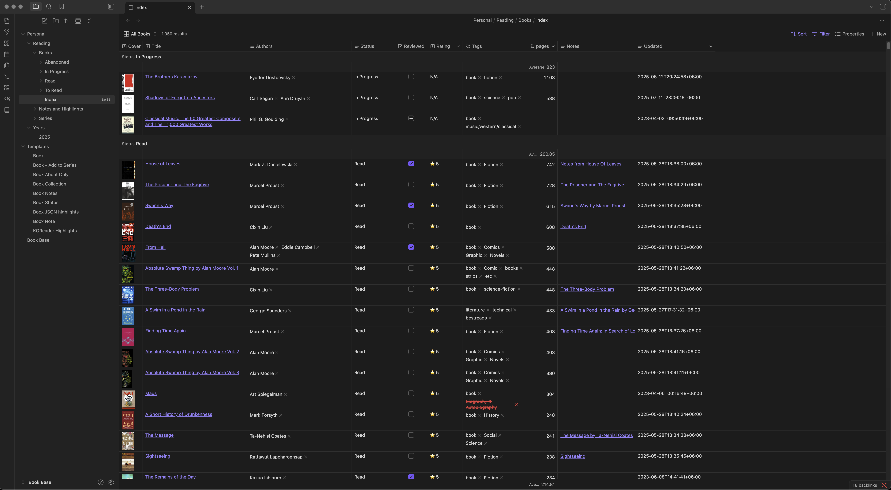
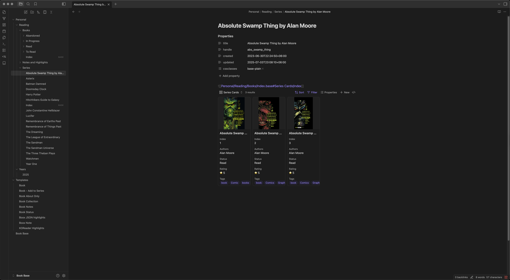
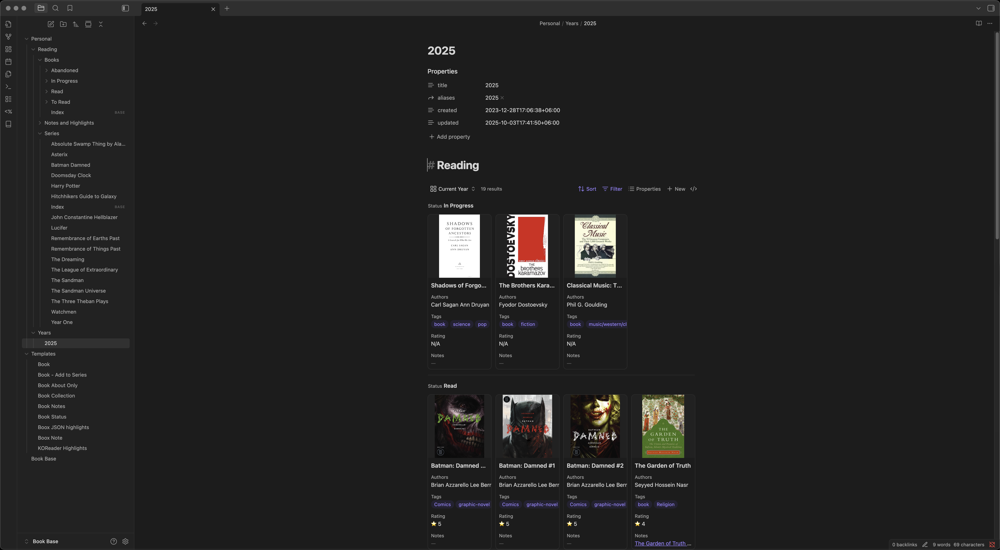

# Book Base

This is a vault comprising my reading management flow.





Reading log on sidebar:
![[reading-log.png]]
## Plugins
### Linter
This is the plugin I use to maintain timestamps as metadata in the file. On save, the linter will update the `created` and `updated` timestamps in proper format. To achieve that, you have to set the following options:

1. **General** > Lint on Save: Enabled
2. **YAML**:
	1. Keep track of the date the file was last edited... : Enabled
		1. Date Created: Enabled
		2. Date Created Key: `created`
		3. Date Created Source of Truth: YAML frontmatter
		4. Date Modified: Enabled
		5. Date Modified Key: `updated`
		6. Date Modified Source of Truth: File system
		7. **Format**: `YYYY-MM-DDTHH:mm:ssZ`

### Dataview
For minor renderings.

### Templater
For many of the templating needs.

### Book Search
To fill in book notes easily. Set `Templates/Book.md` as the template and `Personal/Reading/Books/To Read` as the default destinations

### Book Search
To show nicely rendered reading log on sidebar for books
## Structure

```
Personal
    ↳ Reading
        ↳ Books
            ↳ Index.base
            ↳ To Read
            ↳ In Progress
            ↳ Read
            ↳ Abandoned
        ↳ Notes and Highlights
        ↳ Series
            ↳ Index.base
    ↳ Years
Templates
```

## How to use
1. Clone/download this vault.
2. Remove books from `Personal/Reading/Books`'s subfolders.
3. Remove Series from `Personal/Reading/Series`.
4. Remove all from `Personal/Reading/Notes and Highlights`.


> [!WARNING] For Obsidian version 1.10...
> This vault uses `groupBy`, which is not available in versions before `1.10`. If you are using such a version, please remove all `groupBy` entries in the base files.


## Workflow
### Adding a book
The easiest way to add a book is by running the book search plugin. It will create a file for the book in the `Personal/Reading/Books/To Read`.

### Changing Reading Status
I maintain a complete log of reading status that can be cumbersome to edit manually. To do it easily:
1. Go to the book you want to work on.
2. Run the `Book Status` template.
3. Choose the desired status, and the rest will be taken care of.

## Templates
In templates, besides the important ones, there are some utility templates. e.g.:
1. **Boox Note**: to convert highlights exported from the Boox devices.
2. **KOReader Highlights**: to convert highlights exported from KOReader.

Usage of these templates is explained in detail on https://hermitage.utsob.me